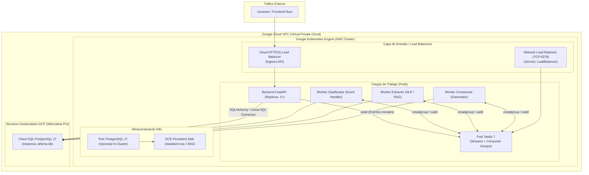

# Guía de Despliegue y Configuración de Cluster Kubernetes (GKE) en Google Cloud Platform (GCP)

Este documento describe la arquitectura, estrategia de aprovisionamiento, manifiestos y consideraciones técnicas para migrar y desplegar la infraestructura de **Athena** desde el entorno local de desarrollo (`devel`) hacia **Google Cloud Platform (GCP)** para los entornos de pruebas y producción (`main`).

---

## 1. Arquitectura Objetivo en GCP

En Google Cloud Platform se tienen dos alternativas arquitectónicas principales para el soporte de **Redis Streams** y **PostgreSQL**:

### Opción A: Arquitectura Híbrida Gestionada (Recomendada para Producción)
- **Cómputo / API / Workers:** Google Kubernetes Engine (GKE) o Cloud Run.
- **Base de Datos:** **Cloud SQL para PostgreSQL 17** (Gestionado con backups automáticos, alta disponibilidad y mantenimiento de parches).
- **Message Broker:** Redis 7 desplegado en GKE o **Cloud Memorystore for Redis**.

### Opción B: Cluster GKE Autónomo (In-Cluster Redis + PostgreSQL)
- Tanto Redis como PostgreSQL residen dentro de Pods en el cluster GKE con volúmenes persistentes gestionados por Google Cloud Engine Persistent Disks (`standard-rwo`).
- Se utiliza un **Service tipo LoadBalancer** de GCP (Network TCP Load Balancer) para otorgar una IP externa o interna a Redis.



---

## 2. Diferencias Clave: Servidor Local (`devel`) vs GCP

| Componente / Aspecto | Servidor Local (`devel` con k3s) | Google Cloud Platform (GCP) |
|---|---|---|
| **Control Plane** | Mononodo k3s local | **GKE Autopilot** o GKE Standard (HA gestionada por Google) |
| **Acceso a Red** | Tailscale Mesh VPN (`100.95.220.1`) | **VPC de GCP** + Subnets + Private Service Connect |
| **Balanceador de Carga** | `NodePort` (`30379`, `30432`) | **Google Cloud Network Load Balancer** (`type: LoadBalancer`) |
| **Almacenamiento Persistente** | `local-path` en disco local | **GCE Persistent Disk** (`standard-rwo`, `premium-rwo`) |
| **Seguridad de Secretos** | Secretos Base64 en K8s | **Google Secret Manager** o K8s Secrets con KMS Envelope Encryption |
| **Gestión de Base de Datos** | Pod en cluster con respaldo manual | **Cloud SQL** (`athena-db`) con snapshots automáticos |
| **Costos Operativos** | $0 USD (Hardware existente) | ~$40 - $120 USD/mes según dimensionamiento |

---

## 3. Guía Paso a Paso para Despliegue en GCP

### Paso 1: Configuración de Entorno y CLI `gcloud`

```bash
# 1. Autenticación con cuenta de Google Cloud
gcloud auth login

# 2. Establecer el proyecto activo
gcloud config set project <GCP_PROJECT_ID>

# 3. Habilitar APIs necesarias en GCP
gcloud services enable \
    container.googleapis.com \
    compute.googleapis.com \
    sqladmin.googleapis.com \
    artifactregistry.googleapis.com \
    secretmanager.googleapis.com
```

---

### Paso 2: Creación del Cluster GKE

Para cargas de trabajo de desarrollo/producción con balance costo-beneficio:

```bash
gcloud container clusters create athena-gke-cluster \
    --region us-central1 \
    --node-locations us-central1-a \
    --num-nodes 2 \
    --machine-type e2-standard-2 \
    --disk-size 40GB \
    --disk-type pd-standard \
    --enable-ip-alias \
    --release-channel regular

# Obtener credenciales para kubectl local
gcloud container clusters get-credentials athena-gke-cluster --region us-central1
```

---

### Paso 3: Manifiestos de Redis para GKE con Load Balancer Externo

#### 3.1. Secret de Redis (`k8s/gcp/redis-secret.yaml`)
```yaml
apiVersion: v1
kind: Secret
metadata:
  name: redis-secret
type: Opaque
data:
  password: <PASSWORD_EN_BASE64>   # echo -n "TuPasswordProduccionSeguro" | base64
```

#### 3.2. Deployment de Redis (`k8s/gcp/redis-deployment.yaml`)
```yaml
apiVersion: apps/v1
kind: Deployment
metadata:
  name: redis
  labels:
    app: redis
spec:
  replicas: 1
  selector:
    matchLabels:
      app: redis
  template:
    metadata:
      labels:
        app: redis
    spec:
      containers:
      - name: redis
        image: redis:7-alpine
        ports:
        - containerPort: 6379
        command: ["redis-server", "--requirepass", "$(REDIS_PASSWORD)"]
        env:
        - name: REDIS_PASSWORD
          valueFrom:
            secretKeyRef:
              name: redis-secret
              key: password
        resources:
          requests:
            memory: "256Mi"
            cpu: "200m"
          limits:
            memory: "512Mi"
            cpu: "500m"
```

#### 3.3. Service con Load Balancer de GCP (`k8s/gcp/redis-loadbalancer.yaml`)
```yaml
apiVersion: v1
kind: Service
metadata:
  name: redis-loadbalancer
  labels:
    app: redis
spec:
  type: LoadBalancer
  selector:
    app: redis
  ports:
  - protocol: TCP
    port: 6379
    targetPort: 6379
```

> [!IMPORTANT]
> Al aplicar este Service en GKE, el controlador de nube de Google provisiona automáticamente un **Google Cloud Network Load Balancer (Pass-through TCP)** y asigna una **IP pública externa** estática accesible en el puerto `6379`.

Para obtener la IP pública asignada por GCP:
```bash
kubectl get svc redis-loadbalancer --watch
```

---

### Paso 4: Despliegue de PostgreSQL en GKE

Si se opta por alojar PostgreSQL en el cluster (en lugar de Cloud SQL):

#### 4.1. PVC con StorageClass de Google Cloud (`k8s/gcp/postgres-pvc.yaml`)
```yaml
apiVersion: v1
kind: PersistentVolumeClaim
metadata:
  name: postgres-pvc
spec:
  accessModes:
    - ReadWriteOnce
  storageClassName: standard-rwo   # Driver de GCE Persistent Disk
  resources:
    requests:
      storage: 20Gi
```

#### 4.2. Deployment de PostgreSQL (`k8s/gcp/postgres-deployment.yaml`)
```yaml
apiVersion: apps/v1
kind: Deployment
metadata:
  name: postgres
  labels:
    app: postgres
spec:
  replicas: 1
  selector:
    matchLabels:
      app: postgres
  template:
    metadata:
      labels:
        app: postgres
    spec:
      containers:
      - name: postgres
        image: postgres:17
        ports:
        - containerPort: 5432
        env:
        - name: POSTGRES_USER
          valueFrom:
            secretKeyRef:
              name: postgres-secret
              key: POSTGRES_USER
        - name: POSTGRES_PASSWORD
          valueFrom:
            secretKeyRef:
              name: postgres-secret
              key: POSTGRES_PASSWORD
        - name: POSTGRES_DB
          valueFrom:
            secretKeyRef:
              name: postgres-secret
              key: POSTGRES_DB
        volumeMounts:
        - name: postgres-storage
          mountPath: /var/lib/postgresql/data
          subPath: pgdata
        resources:
          requests:
            memory: "512Mi"
            cpu: "250m"
          limits:
            memory: "1Gi"
            cpu: "1000m"
      volumes:
      - name: postgres-storage
        persistentVolumeClaim:
          claimName: postgres-pvc
```

#### 4.3. Service Interno para PostgreSQL (`k8s/gcp/postgres-service.yaml`)
```yaml
apiVersion: v1
kind: Service
metadata:
  name: postgres-service
  labels:
    app: postgres
spec:
  type: ClusterIP
  selector:
    app: postgres
  ports:
  - protocol: TCP
    port: 5432
    targetPort: 5432
```

---

### Paso 5: Inicialización del Esquema SQL

Una vez desplegado el Pod de PostgreSQL en GKE:

```bash
# 1. Obtener nombre del pod
POD_PG=$(kubectl get pod -l app=postgres -o jsonpath='{.items[0].metadata.name}')

# 2. Copiar los scripts del repositorio al Pod
kubectl cp DataBase/scripts/generate_tables.sql $POD_PG:/tmp/generate_tables.sql

# 3. Ejecutar las sentencias SQL
kubectl exec -i $POD_PG -- psql -U admin -d athena -f /tmp/generate_tables.sql
```

---

## 4. Consideraciones de Seguridad en Google Cloud

### 4.1. Protección de Redis Expuesto al Exterior
> [!WARNING]
> Exponer Redis con una IP pública (`0.0.0.0/0`) en el puerto `6379` es altamente vulnerable a ataques de fuerza bruta y saturación. En GCP se deben implementar las siguientes salvaguardas:

#### Opción 1: Restricción por Rangos CIDR (`loadBalancerSourceRanges`)
Limitar el acceso únicamente a las IPs de origen autorizadas (por ejemplo, la IP de salida de la oficina o de los servidores de backend):

```yaml
spec:
  type: LoadBalancer
  loadBalancerSourceRanges:
    - 203.0.113.50/32    # IP fija autorizada
    - 198.51.100.0/24   # Rango institucional
```

#### Opción 2: Internal Load Balancer (ILB) en la VPC de GCP
Si el backend corre dentro de GCP (en Cloud Run mediante Serverless VPC Access o Compute Engine), se debe utilizar un **Internal Load Balancer**:

```yaml
apiVersion: v1
kind: Service
metadata:
  name: redis-internal-lb
  annotations:
    networking.gke.io/load-balancer-type: "Internal"
spec:
  type: LoadBalancer
  selector:
    app: redis
  ports:
  - protocol: TCP
    port: 6379
    targetPort: 6379
```

Esto generará una IP privada (ejemplo: `10.128.0.25`) inaccesible desde Internet público, garantizando seguridad estricta.

---

## 5. Estimación de Costos Mensuales (GCP)

| Recurso | Especificación | Costo Estimado (USD/mes) |
|---|---|---|
| **Cluster GKE (Gestión)** | Modo Standard (1 cluster) | ~$0 (Cubre el free tier de 1 cluster zonal) o ~$73 si es regional |
| **Nodos GKE (Cómputo)** | 2 nodos `e2-standard-2` (4 vCPU, 8 GB RAM total) | ~$48.80 |
| **Network Load Balancer** | Regla de reenvío TCP + Tráfico | ~$18.25 |
| **Persistent Disks (GCE)** | 2 discos de 20 GB standard (`pd-standard`) | ~$1.60 |
| **Cloud SQL (Alternativa)** | `db-custom-1-3840` (1 vCPU, 3.75 GB RAM) | ~$52.00 |
| **Total Estimado (GKE Self-Hosted):** | | **~$68 - $75 USD/mes** |

---

## 6. Automatización de Despliegue con GitHub Actions (CI/CD)

Para automatizar la entrega continua hacia GCP en la rama `main`, se implementa un workflow en `.github/workflows/deploy-gke.yml`:

```yaml
name: Deploy to GKE

on:
  push:
    branches:
      - main

jobs:
  deploy:
    runs-on: ubuntu-latest
    steps:
    - name: Checkout Code
      uses: actions/checkout@v4

    - name: Authenticate to Google Cloud
      uses: google-github-actions/auth@v2
      with:
        credentials_json: ${{ secrets.GCP_SA_KEY }}

    - name: Set up Cloud SDK
      uses: google-github-actions/setup-gcloud@v2

    - name: Get GKE Credentials
      uses: google-github-actions/get-gke-credentials@v2
      with:
        cluster_name: athena-gke-cluster
        location: us-central1

    - name: Apply Kubernetes Manifests
      run: |
        kubectl apply -f k8s/redis-secret.yaml
        kubectl apply -f k8s/postgres-secret.yaml
        kubectl apply -f k8s/postgres-pvc.yaml
        kubectl apply -f k8s/redis-deployment.yaml
        kubectl apply -f k8s/redis-service.yaml
        kubectl apply -f k8s/postgres-deployment.yaml
        kubectl apply -f k8s/postgres-service.yaml
```
