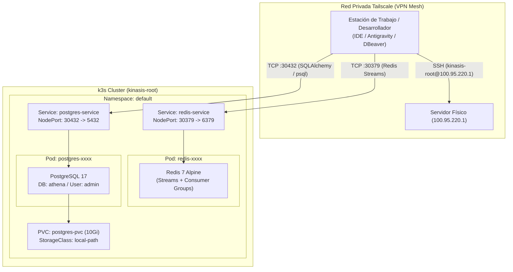
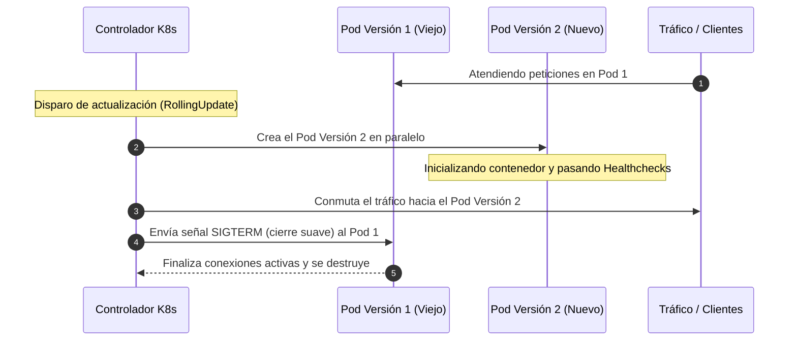

# Despliegue y Configuración de Cluster Kubernetes (k3s) en Servidor Local para Desarrollo

Este documento detalla la arquitectura, configuración, pasos de instalación, manifiestos, ciclo de vida y consideraciones técnicas del entorno de cluster local implementado para la rama `devel` del proyecto **Athena**.

---

## 1. Contexto y Objetivos

El proyecto **Athena** cuenta con una arquitectura orientada a eventos (*event-driven microservices*) que requiere:
- **Redis (versión 7+):** Message broker y distribución de tareas basado en **Redis Streams** y **Consumer Groups** (`XREADGROUP`, `XADD`, `XACK`, `XGROUP CREATE`).
- **PostgreSQL (versión 17):** Persistencia relacional de catálogos académicos (áreas, escuelas, carreras, habilidades), usuarios y resultados de coincidencia vocacional.

Para validar el flujo completo en la rama `devel` antes de realizar despliegues en la nube pública (Google Cloud Platform), se configuró un cluster Kubernetes ligero (**k3s**) en un servidor on-premise conectado a una red privada mesh (**Tailscale**).

### Parámetros del Entorno

| Parámetro | Valor |
|---|---|
| **Servidor Host** | `100.95.220.1` (Red Tailscale) / Usuario: `kinasis-root` |
| **Sistema Operativo** | Ubuntu / Debian GNU/Linux (Kernel 7.0.0-34-generic) |
| **Distribución Kubernetes** | **k3s** v1.36.4 (`control-plane` unificado) |
| **Storage Provisioner** | `local-path` (`/opt/local-path-provisioner/`) |
| **Redis NodePort** | `30379` (mapeado al contenedor `6379`) |
| **PostgreSQL NodePort** | `30432` (mapeado al contenedor `5432`) |

---

## 2. Diagrama de Arquitectura de Red y Cluster



---

## 3. Estructura de Manifiestos y Scripts Creados

Los archivos de infraestructura se encuentran organizados dentro del directorio [`k8s/`](file:///c:/Users/emanu/Documents/METODOLOGIA/Athena/k8s/):

```
Athena/
├── k8s/
│   ├── redis-secret.yaml           # Secret con contraseña cifrada en Base64
│   ├── redis-deployment.yaml       # Deployment de Redis 7 con límites de recursos
│   ├── redis-service.yaml          # Service tipo NodePort en puerto 30379
│   ├── postgres-secret.yaml        # Secret de PostgreSQL (user, password, db)
│   ├── postgres-pvc.yaml           # Reclamo de volumen persistente (10Gi)
│   ├── postgres-deployment.yaml    # Deployment de PostgreSQL 17 montando PVC
│   ├── postgres-service.yaml       # Service tipo NodePort en puerto 30432
│   ├── setup-cluster.sh            # Script de aprovisionamiento e inicialización
│   └── manage-cluster.sh           # Script de control (start, stop, update, rollback, status)
```

---

## 4. Detalle de Manifiestos Kubernetes

### 4.1. Configuración de Redis

#### `k8s/redis-secret.yaml`
```yaml
apiVersion: v1
kind: Secret
metadata:
  name: redis-secret
type: Opaque
data:
  password: a2luYXNpczIwMjU=   
```

#### `k8s/redis-deployment.yaml`
```yaml
apiVersion: apps/v1
kind: Deployment
metadata:
  name: redis
  labels:
    app: redis
spec:
  replicas: 1
  selector:
    matchLabels:
      app: redis
  template:
    metadata:
      labels:
        app: redis
    spec:
      containers:
      - name: redis
        image: redis:7-alpine
        ports:
        - containerPort: 6379
        command: ["redis-server", "--requirepass", "$(REDIS_PASSWORD)"]
        env:
        - name: REDIS_PASSWORD
          valueFrom:
            secretKeyRef:
              name: redis-secret
              key: password
        resources:
          requests:
            memory: "128Mi"
            cpu: "100m"
          limits:
            memory: "256Mi"
            cpu: "250m"
```

#### `k8s/redis-service.yaml`
```yaml
apiVersion: v1
kind: Service
metadata:
  name: redis-service
  labels:
    app: redis
spec:
  type: NodePort
  selector:
    app: redis
  ports:
  - protocol: TCP
    port: 6379
    targetPort: 6379
    nodePort: 30379
```

---

### 4.2. Configuración de PostgreSQL

#### `k8s/postgres-secret.yaml`
```yaml
apiVersion: v1
kind: Secret
metadata:
  name: postgres-secret
type: Opaque
data:
  POSTGRES_USER: YWRtaW4=         
  POSTGRES_PASSWORD: cGFzc3dvcmQ= 
  POSTGRES_DB: YXRoZW5h           
```

#### `k8s/postgres-pvc.yaml`
```yaml
apiVersion: v1
kind: PersistentVolumeClaim
metadata:
  name: postgres-pvc
spec:
  accessModes:
    - ReadWriteOnce
  storageClassName: local-path
  resources:
    requests:
      storage: 10Gi
```

#### `k8s/postgres-deployment.yaml`
```yaml
apiVersion: apps/v1
kind: Deployment
metadata:
  name: postgres
  labels:
    app: postgres
spec:
  replicas: 1
  selector:
    matchLabels:
      app: postgres
  template:
    metadata:
      labels:
        app: postgres
    spec:
      containers:
      - name: postgres
        image: postgres:17
        ports:
        - containerPort: 5432
        env:
        - name: POSTGRES_USER
          valueFrom:
            secretKeyRef:
              name: postgres-secret
              key: POSTGRES_USER
        - name: POSTGRES_PASSWORD
          valueFrom:
            secretKeyRef:
              name: postgres-secret
              key: POSTGRES_PASSWORD
        - name: POSTGRES_DB
          valueFrom:
            secretKeyRef:
              name: postgres-secret
              key: POSTGRES_DB
        volumeMounts:
        - name: postgres-storage
          mountPath: /var/lib/postgresql/data
          subPath: pgdata
      volumes:
      - name: postgres-storage
        persistentVolumeClaim:
          claimName: postgres-pvc
```

> [!NOTE]
> La directiva `subPath: pgdata` evita conflictos con el directorio `lost+found` que el sistema de archivos Linux crea en la raíz del punto de montaje del volumen.

#### `k8s/postgres-service.yaml`
```yaml
apiVersion: v1
kind: Service
metadata:
  name: postgres-service
  labels:
    app: postgres
spec:
  type: NodePort
  selector:
    app: postgres
  ports:
  - protocol: TCP
    port: 5432
    targetPort: 5432
    nodePort: 30432
```

---

## 5. Pasos Ejecutados en el Despliegue Inicial

1. **Verificación de k3s:** Se validó la disponibilidad del runtime k3s y que el nodo `kinasis-root` estuviera en estado `Ready`.
2. **Creación de Manifiestos:** Se generaron los archivos YAML en `$HOME/athena-k8s/`.
3. **Aplicación de Recursos:** `kubectl apply` de Secrets, PVC, Deployments y Services.
4. **Monitoreo de Rollout:** Verificación con `rollout status` hasta que los Pods alcanzaron estado `Running`.
5. **Inicialización del Esquema Relacional:** Se ejecutó el DDL SQL dentro del Pod de PostgreSQL para crear las **10 tablas principales del sistema** (`area`, `escuela`, `habilidad`, `carrera`, `usuario`, `carrera_escuela`, `carrera_habilidad`, `usuario_habilidad`, `resultado`, `criterio`).
6. **Verificación Funcional:** Pruebas de inserción/consumo en Redis Streams y consultas SQL remotas vía Tailscale.

---

## 6. Actualizaciones Progresivas sin Caída (*RollingUpdate*) y *Rollbacks*

### ¿Cómo funciona el RollingUpdate en Kubernetes?

Al actualizar una imagen, configuración o variables de entorno, Kubernetes utiliza la estrategia **`RollingUpdate`** para evitar la caída total del servicio:



1. **Despliegue en paralelo:** Se crea el nuevo Pod sin tocar el Pod en producción.
2. **Validación de salud:** Kubernetes espera a que el nuevo contenedor esté listo.
3. **Redirección de tráfico:** El `Service` redirige las peticiones al nuevo contenedor.
4. **Apagado suave (*Graceful Shutdown*):** El Pod antiguo termina de procesar las transacciones pendientes y se apaga de forma segura.

> [!TIP]
> **Rollback Instantáneo:** Si la nueva versión presenta errores o falla al arrancar, el comando `kubectl rollout undo` revierte de inmediato el tráfico hacia la versión anterior que funcionaba.

---

## 7. Automatización Operativa: Script `manage-cluster.sh`

Se incluye el script [`k8s/manage-cluster.sh`](file:///c:/Users/emanu/Documents/METODOLOGIA/Athena/k8s/manage-cluster.sh) para controlar el ciclo de vida del cluster sin necesidad de recordar comandos largos de `kubectl`.

### Comandos Disponibles

```bash
# Otorgar permisos de ejecución (primera vez)
chmod +x ~/athena-k8s/manage-cluster.sh

# 1. Ver estado general (Pods, NodePorts, PVCs)
./manage-cluster.sh status

# 2. Pausar servicios (Escala a 0 réplicas - Libera CPU y RAM sin borrar datos)
./manage-cluster.sh stop
# Pausar únicamente Redis:
./manage-cluster.sh stop redis

# 3. Iniciar o reactivar servicios (Escala a 1 réplica)
./manage-cluster.sh start
# Iniciar únicamente PostgreSQL:
./manage-cluster.sh start postgres

# 4. Actualización progresiva limpia (RollingUpdate sin caída de servicio)
./manage-cluster.sh update

# 5. Botón de pánico / Rollback (Deshace el último cambio y vuelve a la versión previa)
./manage-cluster.sh rollback

# 6. Ver historial de despliegues
./manage-cluster.sh history

# 7. Reinicio rápido de servicios
./manage-cluster.sh restart
```

---

## 8. Variables de Entorno para Servicios y Backend

Para interactuar con el cluster desde los módulos de desarrollo (`Backend`, tareas en segundo plano o scripts de prueba), configure el archivo `.env`:

```env

---

## 9. Consideraciones Técnicas y Precauciones

> [!WARNING]
> **Persistencia Local (`local-path`):**
> Los datos de PostgreSQL residen en el disco local del nodo en `/opt/local-path-provisioner/`. Si el volumen se elimina (`kubectl delete pvc postgres-pvc`), **los datos se perderán de manera irreversible**. Pausar con `./manage-cluster.sh stop` **no borra los datos**.

> [!IMPORTANT]
> **Seguridad en Red:**
> El acceso a los puertos `30379` y `30432` está protegido por el cifrado y autenticación de la red **Tailscale**. Ninguno de estos puertos está expuesto a Internet público.

> [!TIP]
> **Gestión de Recursos:**
> Los límites de memoria (256 MB para Redis, 512 MB para PostgreSQL) son adecuados para desarrollo y pruebas de carga moderadas. Si se procesan grandes volúmenes de embeddings vectoriales en memoria, se debe incrementar el límite de PostgreSQL en `postgres-deployment.yaml`.
